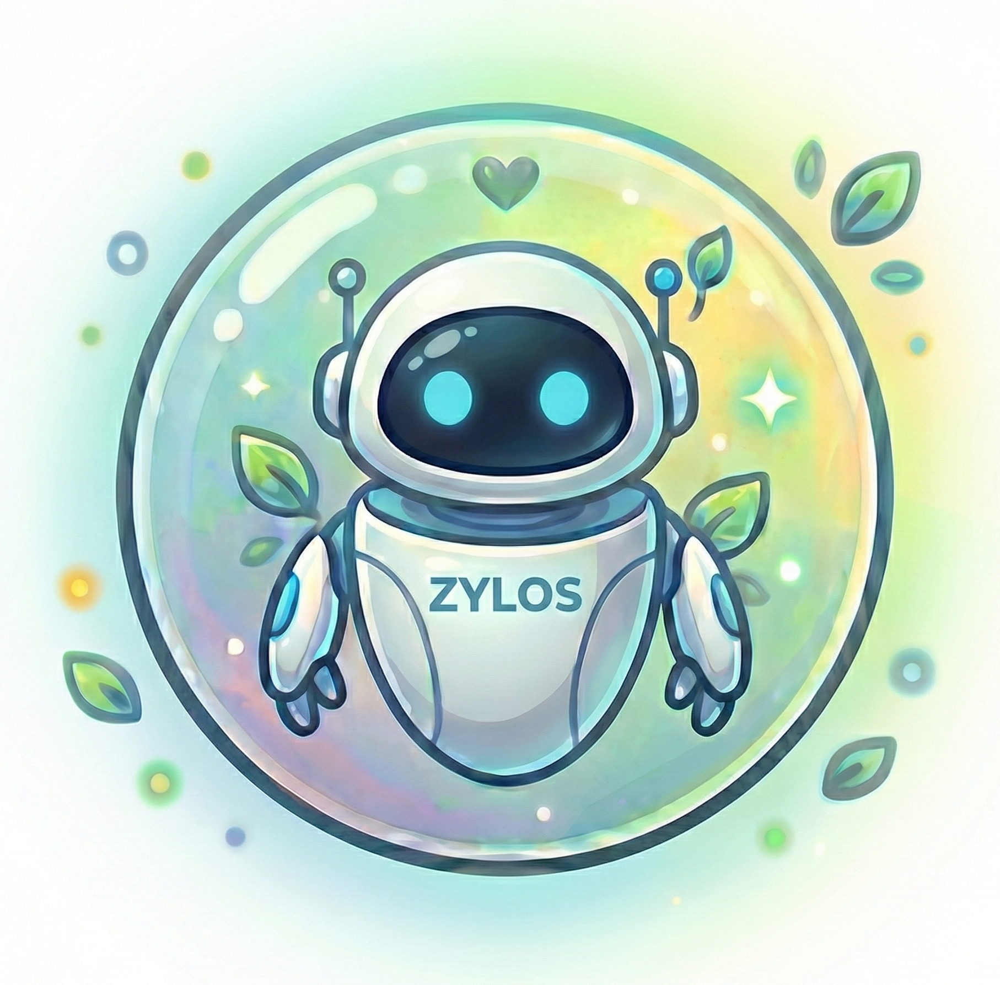

<p align="center">
  
</p>

<h1 align="center">zylos-telegram</h1>

<p align="center">
  <a href="https://github.com/zylos-ai/zylos-core">Zylos</a> 智能体的 Telegram 通讯组件。
</p>

<p align="center">
  <a href="./LICENSE"></a>
  <a href="https://nodejs.org/"></a>
</p>

<p align="center">
  <a href="./README.md">English</a>
</p>

---

- **Telegram 对话** — 你的 AI 智能体接入 Telegram，支持私聊和群聊
- **智能群组监控** — 自动关注指定群组的所有讨论，无需 @
- **零配置启动** — 第一条消息自动绑定为管理员，无需繁琐设置
- **媒体支持** — 无缝收发图片、文档和文件

## 快速开始

告诉你的 Zylos 智能体：

> "安装 telegram 组件"

或使用 CLI：

```bash
zylos add telegram
```

Zylos 会引导你完成设置，包括从 [@BotFather](https://t.me/botfather) 获取 Bot Token。安装完成后，在 Telegram 上给机器人发消息 — 第一个交互的用户自动成为管理员。

## 管理机器人

直接告诉你的 Zylos 智能体：

| 操作 | 示例 |
|------|------|
| 添加白名单用户 | "把 @john 加入 Telegram 白名单" |
| 启用智能群组 | "把这个群设为智能群组" |
| 查看状态 | "看下 Telegram 机器人状态" |
| 重启机器人 | "重启 Telegram 机器人" |
| 升级组件 | "升级 Telegram 组件" |
| 卸载组件 | "卸载 Telegram 组件" |

或通过 CLI 管理：

```bash
zylos upgrade telegram
zylos uninstall telegram
```

## 群聊行为

| 场景 | 机器人响应 |
|------|-----------|
| 私聊（管理员/白名单） | 通过 Claude 回复 |
| 智能群组消息 | 接收所有消息 |
| 在允许的群里 @机器人 | 带上下文回复 |
| 管理员在任意群 @机器人 | 始终回复 |
| 未知用户 | 忽略 |

## 文档

- [SKILL.md](./SKILL.md) — 组件规格说明
- [DESIGN.md](./DESIGN.md) — 架构与设计
- [CHANGELOG.md](./CHANGELOG.md) — 版本历史

## 参与贡献

请查看[贡献指南](https://github.com/zylos-ai/.github/blob/main/CONTRIBUTING.md)。

## 由 Coco 构建

Zylos 是 [Coco](https://coco.xyz/)（AI 员工平台）的开源核心基础设施。

我们构建 Zylos 是因为我们自己需要它：可靠的基础设施，让 AI 智能体 24/7 稳定运行。每个组件都在 Coco 生产环境中经过实战检验，服务于每天依赖 AI 员工的团队。

想要开箱即用？[Coco](https://coco.xyz/) 提供即开即用的 AI 员工——持久记忆、多渠道沟通、技能包——5 分钟完成部署。

## 许可证

[MIT](./LICENSE)
